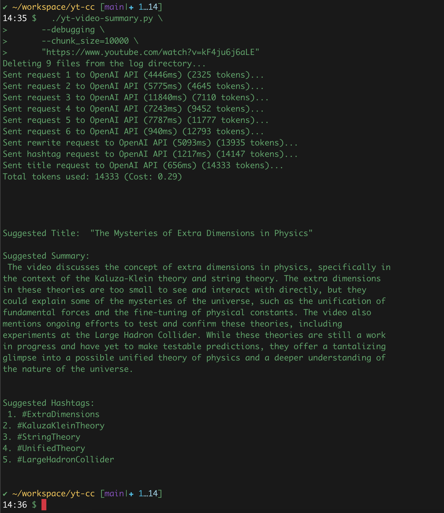

# YouTube Subtitle Summarization
This Python script will download subtitles for a given YouTube video URL, reformat the text and then, create a video summary using the OpenAI API. 

## Requirements
- Python 3.x
- OpenAI API key
- Install required libraries

```console
  pip3 install openai
  pip3 install yt-dlp
```

## Usage
- Clone the Git repository to your local machine.

Set your OpenAI API key as an environment variable: 
```console
  export OPENAI_API_KEY=your_api_key_here.
```

Run the script with the following command:
```console
  ./yt-video-summary.py "https://www.youtube.com/watch?v=kF4ju6j6aLE"
```



## License

This project is licensed under the MIT License. See the LICENSE file for more information.
